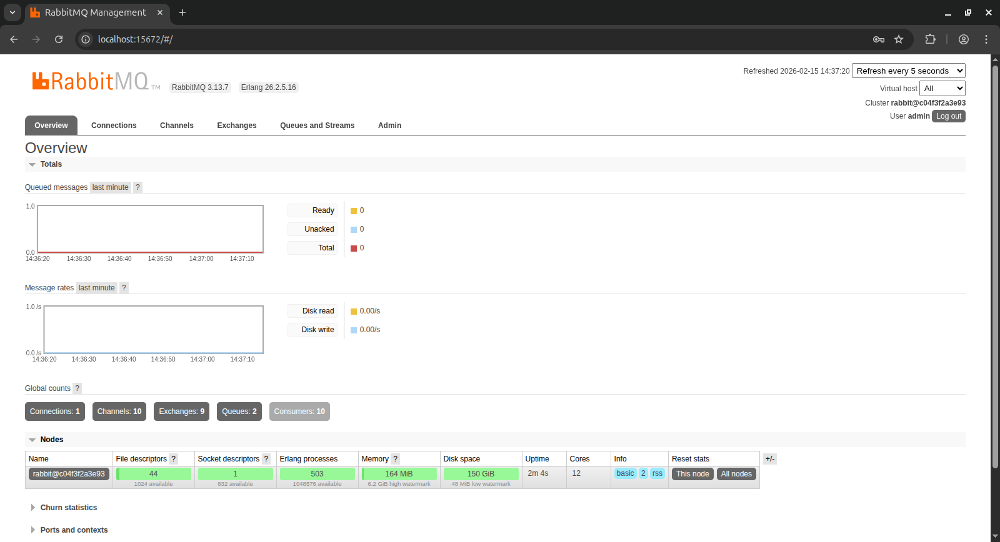

# Phần 1: Message Queue là gì?
Message Queue (MQ) là một hệ thống trung gian cho phép các ứng dụng giao tiếp với nhau thông qua việc gửi và nhận các tin nhắn. MQ giúp tách rời các thành phần của hệ thống, cho phép chúng hoạt động độc lập và không bị ảnh hưởng bởi nhau. Điều này giúp tăng tính linh hoạt, khả năng mở rộng và độ tin cậy của hệ thống.

**Tại sao sử dụng Message Queue?**
- **Tách rời các thành phần**: MQ cho phép các dịch vụ hoạt động độc lập, giúp giảm sự phụ thuộc giữa chúng.
- **Xử lý bất đồng bộ**: Các tin nhắn có thể được gửi và nhận mà không cần phải chờ đợi, giúp cải thiện hiệu suất hệ thống.
- **Tăng khả năng mở rộng**: MQ cho phép thêm hoặc bớt các thành phần một cách dễ dàng mà không ảnh hưởng đến toàn bộ hệ thống.
- **Đảm bảo độ tin cậy**: MQ có thể lưu trữ các tin nhắn cho đến khi chúng được xử lý, giúp đảm bảo rằng không có dữ liệu nào bị mất.

**Lợi ích của việc sử dụng Message Queue**
- **Cải thiện hiệu suất**: Bằng cách xử lý các tác vụ một cách bất đồng bộ, hệ thống có thể hoạt động nhanh hơn và hiệu quả hơn.
- **Tăng tính sẵn sàng**: Nếu một thành phần gặp sự cố, các tin nhắn vẫn có thể được lưu trữ và xử lý sau khi thành phần đó hoạt động trở lại.
- **Dễ dàng mở rộng**: Hệ thống có thể dễ dàng mở rộng bằng cách thêm nhiều hàng đợi hoặc các dịch vụ xử lý tin nhắn mới.
- **Quản lý tải**: MQ giúp phân phối tải công việc đều hơn giữa các thành phần, tránh tình trạng quá tải.
- **Hỗ trợ đa nền tảng**: MQ thường hỗ trợ nhiều ngôn ngữ lập trình và nền tảng khác nhau, giúp tích hợp dễ dàng hơn.

**Nhược điểm của việc sử dụng Message Queue**
- **Độ trễ**: Việc gửi và nhận tin nhắn qua MQ có thể gây ra độ trễ so với giao tiếp trực tiếp.
- **Phức tạp trong quản lý**: Việc triển khai và quản lý hệ thống MQ có thể phức tạp và đòi hỏi kiến thức chuyên sâu.
- **Chi phí vận hành**: Sử dụng MQ có thể tăng chi phí vận hành do cần phải duy trì hệ thống trung gian.
- **Khó khăn trong việc debug**: Việc theo dõi và gỡ lỗi các vấn đề liên quan đến MQ có thể khó khăn hơn so với các hệ thống trực tiếp.
- **Yêu cầu bảo mật**: Việc truyền tin nhắn qua MQ có thể tạo ra các lỗ hổng bảo mật nếu không được quản lý đúng cách.

Vậy nên, việc sử dụng Message Queue cần được cân nhắc kỹ lưỡng dựa trên yêu cầu và đặc điểm của hệ thống để tận dụng tối đa lợi ích mà nó mang lại.

---
# Phần 2: Các hệ thống Message Queue phổ biến
Dưới đây là một số hệ thống Message Queue phổ biến được sử dụng rộng rãi trong ngành công nghiệp phần mềm:

## Kafka

**Apache Kafka** là một nền tảng **distributed event streaming** (xử lý luồng sự kiện phân tán) mã nguồn mở. Kafka được thiết kế để **xử lý throughput rất lớn**, **độ trễ thấp**, **mở rộng ngang tốt** và lưu trữ dữ liệu dạng log theo thời gian (retention). Kafka thường dùng cho các bài toán: thu thập log, event-driven microservices, streaming dữ liệu realtime, analytics, pipeline dữ liệu.

### 1. Một số khái niệm cơ bản trong Kafka

* **Producer:** Ứng dụng gửi (publish) message/event vào Kafka.
* **Consumer:** Ứng dụng đọc (subscribe) message/event từ Kafka.
* **Topic:** “Chủ đề” để phân loại message. Producer gửi vào topic, consumer đọc từ topic.
* **Partition:** Mỗi topic được chia thành nhiều partition. Partition là **đơn vị song song (parallelism)** và **thứ tự (ordering)** trong Kafka.

    * **Kafka chỉ đảm bảo thứ tự trong cùng 1 partition**, không đảm bảo thứ tự toàn topic nếu có nhiều partition.
* **Broker:** Một node Kafka server. Một cluster Kafka gồm nhiều broker.
* **Replication (bản sao):** Mỗi partition có thể có nhiều bản sao (replicas) trên các broker khác nhau để tăng độ tin cậy.
* **Leader / Follower (Replica):**

    * Mỗi partition có **1 leader** (nhận ghi/đọc chính)
    * Các follower replicate dữ liệu từ leader.
* **Offset:** Số thứ tự của message trong 1 partition. Consumer đọc message theo offset.
* **Consumer Group:** Nhóm consumer cùng đọc 1 topic để chia tải.
  Quy tắc quan trọng:

    * Trong **một consumer group**, **mỗi partition chỉ được gán cho tối đa 1 consumer** tại một thời điểm.
    * Muốn tăng song song → tăng số partition hoặc tăng số group phù hợp.
* **Retention:** Kafka lưu message theo thời gian hoặc dung lượng (ví dụ giữ 7 ngày), không phải “đọc xong là mất” như queue truyền thống.
* **Acknowledgement (acks):** Cơ chế producer chờ xác nhận ghi thành công:

    * `acks=0`: không chờ xác nhận (nhanh nhưng rủi ro mất)
    * `acks=1`: leader ack
    * `acks=all`: leader + ISR (an toàn hơn)

> Lưu ý: Kafka thường được gọi là “message queue”, nhưng bản chất mạnh nhất của nó là **commit log / event streaming**.

### 2. Cơ chế hoạt động (luồng dữ liệu)

1. **Producer** gửi event vào một **topic**.
2. Kafka quyết định ghi event vào **partition** nào (theo key hoặc round-robin).
3. Event được ghi append-only vào log của partition (tạo **offset**).
4. **Consumer** trong một **consumer group** sẽ được phân công (assign) các partition để đọc.
5. Consumer xử lý xong sẽ **commit offset** (để Kafka biết consumer đã đọc tới đâu).

### 3. Partitioning và Ordering (thứ tự)

* Kafka **đảm bảo thứ tự theo partition**, nên nếu bạn cần “events của cùng 1 user phải theo đúng thứ tự”, bạn nên:

    * gửi message với **key = userId**
      → Kafka sẽ route các message cùng key vào cùng partition → giữ đúng order cho user đó.

### 4. Delivery semantics (đảm bảo giao nhận)

Kafka thường gặp 3 khái niệm:

* **At most once:** Có thể mất message, không xử lý trùng.
* **At least once (phổ biến nhất):** Không mất message nhưng **có thể xử lý trùng** nếu retry / consumer crash → cần **idempotency** ở consumer.
* **Exactly once (EOS):** Kafka có cơ chế hỗ trợ “exactly-once” (phức tạp hơn), thường dùng khi streaming/pipeline cần độ chính xác cao.

### 5. Ưu điểm & nhược điểm

**Ưu điểm**

* Throughput rất lớn, scale ngang tốt (thêm broker/partition).
* Retention: lưu event theo thời gian → replay/đọc lại được.
* Consumer group giúp chia tải tốt.
* Phù hợp event-driven architecture, streaming, analytics.

**Nhược điểm**

* Vận hành/cấu hình phức tạp hơn (partition, replication, tuning).
* Không “dễ dùng” như RabbitMQ cho các job queue nhỏ.
* Không tối ưu cho routing linh hoạt kiểu exchange/binding như RabbitMQ.

---
## Rabbit MQ
### 1. Một số khái niệm cơ bản trong Rabbit MQ
* **Producer:** Ứng dụng gửi message.
* **Consumer:** Ứng dụng nhận message.
* **Queue:** Lưu trữ messages.
* **Message:** Thông tin truyền từ Producer đến Consumer qua RabbitMQ.
* **Connection:** Một kết nối TCP giữa ứng dụng và RabbitMQ broker.
* **Channel:** Một kết nối ảo trong một Connection. Việc publishing hoặc consuming từ một queue đều được thực hiện trên channel.
* **Exchange:** Là nơi nhận message được publish từ Producer và đẩy chúng vào queue dựa vào quy tắc của từng loại Exchange. Để nhận được message, queue phải được nằm trong ít nhất 1 Exchange.
* **Binding:** Đảm nhận nhiệm vụ liên kết giữa Exchange và Queue.
* **Routing key:** Một key mà Exchange dựa vào đó để quyết định cách để định tuyến message đến queue. Có thể hiểu nôm na, Routing key là địa chỉ dành cho message.
* **AMQP:** Giao thức Advance Message Queuing Protocol, là giao thức truyền message trong RabbitMQ.
* **User:** Để có thể truy cập vào RabbitMQ, chúng ta phải có username và password. Trong RabbitMQ, mỗi user được chỉ định với một quyền hạn nào đó. User có thể được phân quyền đặc biệt cho một Vhost nào đó.
* **Virtual host/Vhost:** Cung cấp những cách riêng biệt để các ứng dụng dùng chung một RabbitMQ instance. Những user khác nhau có thể có các quyền khác nhau đối với vhost khác nhau. Queue và Exchange có thể được tạo, vì vậy chúng chỉ tồn tại trong một vhost.

<div style="text-align:center;">
  
</div>

### 2. Các loại Exchange trong Rabbit MQ
#### a. Direct Exchange
Direct Exchange vận chuyển message đến queue dựa vào routing key. Thường được sử dụng cho việc định tuyến tin nhắn unicast-đơn hướng (mặc dù nó có thể sử dụng cho định tuyến multicast-đa hướng). Các bước định tuyến message:
* Một queue được ràng buộc với một direct exchange bởi một routing key K.
* Khi có một message mới với routing key R đến direct exchange. Message sẽ được chuyển tới queue đó nếu R=K.

<div style="text-align:center;">
  
</div>

#### b. Default Exchange
Mỗi một exchange đều được đặt một tên không trùng nhau, default exchange bản chất là một direct exchange nhưng không có tên (string rỗng). Nó có một thuộc tính đặc biệt làm cho nó rất hữu ích cho các ứng dụng đơn giản: mọi queue được tạo sẽ tự động được liên kết với nó bằng một routing key giống như tên queue.

Ví dụ, nếu bạn tạo ra 1 queue với tên "hello-world", RabbitMQ broker sẽ tự động binding default exchange đến queue "hello-word" với routing key "hello-world".

#### c. Fanout Exchange
Fanout exchange định tuyến message tới tất cả queue mà nó bao quanh, routing key bị bỏ qua. Giả sử, nếu nó N queue được bao quanh bởi một Fanout exchange, khi một message mới published, exchange sẽ vận chuyển message đó tới tất cả N queues. Fanout exchange được sử dụng cho định tuyến thông điệp broadcast - quảng bá.

<div style="text-align:center;">
  
</div>

#### d. Topic Exchange
Topic exchange định tuyến message tới một hoặc nhiều queue dựa trên sự trùng khớp giữa routing key và pattern. Topic exchange thường sử dụng để thực hiện định tuyến thông điệp multicast. Ví dụ một vài trường hợp sử dụng:
* Phân phối dữ liệu liên quan đến vị trí địa lý cụ thể.
* Xử lý tác vụ nền được thực hiện bởi nhiều workers, mỗi công việc có khả năng xử lý các nhóm tác vụ cụ thể.
* Cập nhật tin tức liên quan đến phân loại hoặc gắn thẻ (ví dụ: chỉ dành cho một môn thể thao hoặc đội cụ thể).
* Điều phối các dịch vụ của các loại khác nhau trong cloud

#### e. Headers Exchange
Header exchange được thiết kế để định tuyến với nhiều thuộc tính, đễ dàng thực hiện dưới dạng tiêu đề của message hơn là routing key. Header exchange bỏ đi routing key mà thay vào đó định tuyến dựa trên header của message. Trường hợp này, broker cần một hoặc nhiều thông tin từ application developer, cụ thể là, nên quan tâm đến những tin nhắn với tiêu đề nào phù hợp hoặc tất cả chúng.

## So sánh RabbitMQ và Kafka

| Tiêu chí                           | RabbitMQ                       | Kafka                                       |
| ---------------------------------- | ------------------------------ | ------------------------------------------- |
| Dùng khi                           | Job/task queue (xử lý nền)     | Event streaming (log sự kiện)               |
| Throughput                         | Tốt                            | Rất cao                                     |
| Latency                            | Rất thấp (ms)                  | Thấp nhưng thiên về throughput              |
| Lưu message                        | Consume xong thường mất        | Lưu theo retention, đọc lại được            |
| Retry/DLQ                          | Dễ, built-in mạnh              | Làm được nhưng thường phải tự thiết kế      |
| Vận hành                           | Dễ hơn                         | Phức tạp hơn                                |
| Phù hợp dự án check-in + cộng điểm | ✅ Rất hợp (đơn giản, hiệu quả) | ✅ Hợp nếu muốn scale cực lớn + replay event |

---
# Phần 3: Cài đặt và sử dụng RabbitMQ với Spring Boot
## 1. Cài đặt RabbitMQ
Để cài đặt RabbitMQ, bạn có thể sử dụng Docker hoặc cài đặt trực tiếp trên máy tính của mình.

### Cài đặt bằng Docker
```bash
docker run -d --hostname my-rabbit --name rabbitmq -p 5672:5672 -p 15672:15672 rabbitmq:3-management
```

hoặc viết trong file `docker-compose.yml`:
```yaml
msqueue:
  image: rabbitmq:3-management-alpine
  container_name: msqueue
  ports:
    - 15672:15672
    - 5672:5672
  environment:
    - RABBITMQ_DEFAULT_USER=${RABBITMQ_DEFAULT_USER}
    - RABBITMQ_DEFAULT_PASS=${RABBITMQ_DEFAULT_PASS}
    - RABBITMQ_DEFAULT_VHOST=${RABBITMQ_DEFAULT_VHOST}
  networks:
    - minilab
```
### Cài đặt trực tiếp
Bạn có thể tải RabbitMQ từ trang chủ: https://www.rabbitmq.com/download.html và làm theo hướng dẫn cài đặt cho hệ điều hành của bạn.

<div style="text-align:center;">
  
</div>
---

## 2. Sử dụng RabbitMQ với Spring Boot
Để sử dụng RabbitMQ trong ứng dụng Spring Boot, bạn cần thêm dependency sau vào file `pom.xml`:
```xml
<dependency>
    <groupId>org.springframework.boot</groupId>
    <artifactId>spring-boot-starter-amqp</artifactId>
</dependency>
```
### 2.1. Cấu hình RabbitMQ
Bạn có thể cấu hình RabbitMQ trong file `application.properties` hoặc `application.yml`:
```properties
# RabbitMQ Configuration - Basic connection settings only
spring.rabbitmq.host=${RABBITMQ_DEFAULT_HOST:localhost}
spring.rabbitmq.port=${RABBITMQ_DEFAULT_PORT:5672}
spring.rabbitmq.username=${RABBITMQ_DEFAULT_USER:admin}
spring.rabbitmq.password=${RABBITMQ_DEFAULT_PASS:admin123}
spring.rabbitmq.virtual-host=${RABBITMQ_DEFAULT_VHOST:/mini-lab}
```
### 2.2. Tạo Queue, Exchange và Binding
Kiến trúc đuoc đề xuất sẽ sử dụng một **Topic Exchange** để định tuyến message và một **Direct Exchange** để xử lý Dead Letter.

Tạo file `RabbitMQConfig.java` để cấu hình Queue, Exchange và Binding:
```java
@Configuration
public class RabbitMQConfig {
    public static final String EXCHANGE = "app.exchange";
    public static final String ITEM_CREATED_Q = "item.created.q";

    public static final String DLX = "item.dlx";
    public static final String DLQ = "item.dlq";

    // Tạo một Topic Exchange cho ứng dụng
    @Bean
    TopicExchange appExchange() { return new TopicExchange(EXCHANGE); }

    // Tạo một Direct Exchange cho các message bị lỗi (Dead Letter)
    @Bean
    DirectExchange deadLetterExchange() { return new DirectExchange(DLX); }

    // Tạo một Queue chính với cấu hình thêm Dead Letter Exchange cho các message bị lỗi
    @Bean
    Queue itemCreatedQueue() {
        return QueueBuilder.durable(ITEM_CREATED_Q)
                .deadLetterExchange(DLX)
                .deadLetterRoutingKey("item.created.dlq")
                .build();
    }

    // Tạo một Queue Dead Letter để nhận các message bị lỗi từ Queue chính
    @Bean
    Queue itemDlq() { return QueueBuilder.durable(DLQ).build(); }

    //  Binding Queue chính với Topic Exchange để nhận các message có routing key "item.created"
    @Bean
    Binding bindMain() {
        return BindingBuilder.bind(itemCreatedQueue())
                .to(appExchange())
                .with("item.created");
    }

    // Binding Queue Dead Letter với Direct Exchange để nhận các message bị lỗi có routing key "item.created.dlq"
    @Bean
    Binding bindDlq() {
        return BindingBuilder.bind(itemDlq())
                .to(deadLetterExchange())
                .with("item.created.dlq");
    }
}
```

### 2.3. Cấu hình số lượng consumer, độ trễ và retry
Cấu hình các thông số liên quan đến kết nối, listener và retry trong file `application.properties`:

```properties
# Cấu hình kết nối RabbitMQ
# Đặt timeout kết nối và heartbeat để đảm bảo kết nối ổn định
spring.rabbitmq.connection-timeout=${RABBITMQ_CONNECTION_TIMEOUT:10000}
# Đặt heartbeat để giữ kết nối sống và phát hiện nhanh khi broker không phản hồi
spring.rabbitmq.requested-heartbeat=${RABBITMQ_HEARTBEAT:60}

# Cấu hình số lượng consumer tối thiểu và tối đa để xử lý message, giúp tăng khả năng mở rộng và hiệu suất của hệ thống
# Đặt số lượng consumer tối thiểu để đảm bảo luôn có đủ worker sẵn sàng xử lý message 
spring.rabbitmq.listener.simple.concurrency=${RABBITMQ_LISTENER_CONCURRENCY:10}
# Đặt số lượng consumer tối đa để tránh quá tải hệ thống khi có nhiều message đến cùng lúc
spring.rabbitmq.listener.simple.max-concurrency=${RABBITMQ_LISTENER_MAX_CONCURRENCY:20}
# Cấu hình prefetch để kiểm soát số lượng message mà mỗi consumer sẽ lấy về trước khi ack, giúp cân bằng tải và tăng hiệu suất xử lý
spring.rabbitmq.listener.simple.prefetch=${RABBITMQ_LISTENER_PREFETCH:20}

# Cấu hình retry để tự động thử lại khi có lỗi xảy ra trong quá trình xử lý message, giúp tăng độ tin cậy của hệ thống
# Bật tính năng retry cho listener
spring.rabbitmq.listener.simple.retry.enabled=${RABBITMQ_RETRY_ENABLED:true}
# Đặt số lần thử lại tối đa để tránh việc retry vô hạn khi có lỗi nghiêm trọng
spring.rabbitmq.listener.simple.retry.max-attempts=${RABBITMQ_RETRY_MAX_ATTEMPTS:3}
# Đặt khoảng thời gian ban đầu giữa các lần retry
spring.rabbitmq.listener.simple.retry.initial-interval=${RABBITMQ_RETRY_INITIAL_INTERVAL:1000}
# Hệ số nhân để tăng khoảng thời gian giữa các lần retry (exponential backoff)
spring.rabbitmq.listener.simple.retry.multiplier=${RABBITMQ_RETRY_MULTIPLIER:2.0}
# Khoảng thời gian tối đa giữa các lần retry
spring.rabbitmq.listener.simple.retry.max-interval=${RABBITMQ_RETRY_MAX_INTERVAL:5000}
```

**Giải thích các thông số:**

| Thông số | Mặc định | Ý nghĩa | Scaling |
|----------|----------|---------|---------|
| `concurrency` | 10 | Số consumer tối thiểu luôn chạy | Low: 5, Medium: 10, High: 20-50 |
| `max-concurrency` | 20 | Số consumer tối đa có thể tăng lên | Low: 10, Medium: 20, High: 50-100 |
| `prefetch` | 20 | Số message mỗi consumer lấy về trước | Low: 10, Medium: 20, High: 50 |
| `max-attempts` | 3 | Số lần retry khi xử lý thất bại | Thường: 3-5 lần |
| `initial-interval` | 1000ms | Thời gian chờ trước retry đầu tiên | Thường: 1-2 giây |
| `multiplier` | 2.0 | Hệ số tăng thời gian chờ mỗi lần retry | Thường: 2.0 (1s→2s→4s) |
| `max-interval` | 5000ms | Thời gian chờ tối đa giữa các retry | Thường: 5-10 giây |

**Timeline retry với cấu hình trên:**
```
Attempt 1: 00:00:00 - FAIL → wait 1s
Attempt 2: 00:00:01 - FAIL → wait 2s (1s × 2.0)
Attempt 3: 00:00:03 - FAIL → wait 4s (2s × 2.0)
After 3 failed attempts → Message sent to Dead Letter Queue
```

---

### 2.4. Tạo Producer để gửi message

Producer là thành phần gửi message vào RabbitMQ. Trong ví dụ này, khi tạo một Item mới, hệ thống sẽ publish một event vào queue.

**Tạo DTO để wrap message với metadata:**

```java
package com.example.demo.dto;

import com.example.demo.model.Item;
import java.util.UUID;

/**
 * Wrapper cho Item events với message metadata
 * Bao gồm messageId để đảm bảo idempotency và phát hiện duplicate
 */
public class ItemEventMessage {
    
    private String messageId;      // Unique ID để track message
    private Item item;             // Dữ liệu item
    private Long timestamp;        // Thời gian tạo message
    private String eventType;      // Loại event: CREATED, UPDATED, DELETED
    
    public ItemEventMessage() {
        this.messageId = UUID.randomUUID().toString(); // Tự động generate unique ID
        this.timestamp = System.currentTimeMillis();
    }
    
    public ItemEventMessage(Item item, String eventType) {
        this();
        this.item = item;
        this.eventType = eventType;
    }
    
    // Getters and Setters...
}
```

**Update ItemService để publish message:**

```java
@Service
public class ItemService {
    private static final Logger logger = LoggerFactory.getLogger(ItemService.class);
    public static final String EXCHANGE = "app.exchange";
    public static final String ROUTING_KEY = "item.created";

    @Autowired
    private ItemRepository itemRepository;

    @Autowired
    private RabbitTemplate rabbitTemplate;

    @Autowired
    private ObjectMapper objectMapper;

    public Item createItem(Item item) {
        // 1. Lưu item vào database
        Item savedItem = itemRepository.save(item);
        
        // 2. Publish event vào RabbitMQ
        publishItemCreatedEvent(savedItem);
        
        return savedItem;
    }

    /**
     * Publish Item Created Event vào RabbitMQ
     * Message bao gồm unique messageId để đảm bảo idempotency
     */
    public void publishItemCreatedEvent(Item item) {
        try {
            // Wrap item trong event message với unique messageId
            ItemEventMessage eventMessage = new ItemEventMessage(item, "CREATED");
            
            String messageJson = objectMapper.writeValueAsString(eventMessage);
            rabbitTemplate.convertAndSend(EXCHANGE, ROUTING_KEY, messageJson);
            
            logger.info("Published item created event for item id: {} with messageId: {}", 
                       item.getId(), eventMessage.getMessageId());
        } catch (Exception e) {
            logger.error("Error publishing item created event", e);
            throw new RuntimeException("Error publishing event to RabbitMQ", e);
        }
    }
}
```

---

### 2.5. Tạo Consumer để nhận và xử lý message

Consumer là thành phần lắng nghe và xử lý message từ RabbitMQ. Consumer cần được thiết kế để đảm bảo **idempotency** (xử lý nhiều lần cho cùng kết quả) và **duplicate detection** (phát hiện message trùng lặp).

**Tạo Entity để track message processing:**

```java
package com.example.demo.model;

import jakarta.persistence.*;
import java.time.Instant;

@Entity
@Table(name = "message_processing_log")
public class MessageProcessingLog {
    
    @Id
    @GeneratedValue(strategy = GenerationType.IDENTITY)
    private Long id;
    
    @Column(nullable = false, unique = true)
    private String messageId;          // Unique message identifier
    
    @Column(nullable = false)
    private String queueName;          // Queue name
    
    @Column(nullable = false)
    private String status;             // PROCESSING, SUCCESS, FAILED
    
    @Column(columnDefinition = "TEXT")
    private String messagePayload;     // Message content
    
    @Column
    private String errorMessage;       // Error details if failed
    
    @Column
    private Integer retryCount = 0;    // Number of retry attempts
    
    @Column(nullable = false)
    private Long processedAt;          // Timestamp when started processing
    
    @Column
    private Long completedAt;          // Timestamp when completed
    
    public MessageProcessingLog() {}
    
    public MessageProcessingLog(String messageId, String queueName, String messagePayload) {
        this.messageId = messageId;
        this.queueName = queueName;
        this.messagePayload = messagePayload;
        this.status = "PROCESSING";
        this.processedAt = Instant.now().toEpochMilli();
    }
    
    public void markAsSuccess() {
        this.status = "SUCCESS";
        this.completedAt = Instant.now().toEpochMilli();
    }
    
    public void markAsFailed(String errorMessage) {
        this.status = "FAILED";
        this.errorMessage = errorMessage;
        this.completedAt = Instant.now().toEpochMilli();
        this.retryCount++;
    }
    
    // Getters and Setters...
}
```

**Tạo Repository:**

```java
package com.example.demo.repository;

import com.example.demo.model.MessageProcessingLog;
import org.springframework.data.jpa.repository.JpaRepository;
import org.springframework.stereotype.Repository;
import java.util.Optional;

@Repository
public interface MessageProcessingLogRepository extends JpaRepository<MessageProcessingLog, Long> {
    
    /**
     * Tìm message processing log theo messageId
     * Dùng để kiểm tra idempotency - tránh xử lý duplicate message
     */
    Optional<MessageProcessingLog> findByMessageId(String messageId);
    
    /**
     * Kiểm tra xem message đã được xử lý thành công chưa
     */
    boolean existsByMessageIdAndStatus(String messageId, String status);
}
```

**Tạo Consumer với Idempotency:**

```java
package com.example.demo.queue;

import com.example.demo.dto.ItemEventMessage;
import com.example.demo.model.Item;
import com.example.demo.model.MessageProcessingLog;
import com.example.demo.repository.MessageProcessingLogRepository;
import com.fasterxml.jackson.databind.ObjectMapper;
import org.slf4j.Logger;
import org.slf4j.LoggerFactory;
import org.springframework.amqp.rabbit.annotation.RabbitListener;
import org.springframework.beans.factory.annotation.Autowired;
import org.springframework.stereotype.Service;
import org.springframework.transaction.annotation.Transactional;
import java.util.Optional;

@Service
public class ItemConsumerService {
    private static final Logger logger = LoggerFactory.getLogger(ItemConsumerService.class);
    private static final String QUEUE_NAME = "item.created.q";

    @Autowired
    private ObjectMapper objectMapper;
    
    @Autowired
    private MessageProcessingLogRepository messageProcessingLogRepository;

    /**
     * Consumer với Idempotency và Duplicate Detection
     * 
     * Các pattern được implement:
     * 1. Idempotency - Xử lý cùng message nhiều lần cho cùng kết quả
     * 2. Duplicate Detection - Skip message đã xử lý
     * 3. At-least-once delivery - Message không bị mất nhưng có thể deliver nhiều lần
     */
    @RabbitListener(queues = QUEUE_NAME, containerFactory = "rabbitListenerContainerFactory")
    @Transactional
    public void handleItemCreatedEvent(String message) {
        ItemEventMessage eventMessage = null;
        MessageProcessingLog processingLog = null;
        
        try {
            // Parse message
            eventMessage = objectMapper.readValue(message, ItemEventMessage.class);
            String messageId = eventMessage.getMessageId();
            
            logger.info("Received message: messageId={}, timestamp={}", 
                       messageId, eventMessage.getTimestamp());
            
            // 🔑 IDEMPOTENCY CHECK: Message đã được xử lý chưa?
            Optional<MessageProcessingLog> existingLog = 
                messageProcessingLogRepository.findByMessageId(messageId);
            
            if (existingLog.isPresent()) {
                MessageProcessingLog existing = existingLog.get();
                
                if ("SUCCESS".equals(existing.getStatus())) {
                    // ✅ Đã xử lý thành công - skip (idempotent behavior)
                    logger.warn("⚠️ DUPLICATE MESSAGE: messageId={} đã được xử lý lúc {}. Bỏ qua.", 
                               messageId, existing.getCompletedAt());
                    return; // ACK message mà không xử lý lại
                    
                } else if ("PROCESSING".equals(existing.getStatus())) {
                    // ⚠️ Đang được xử lý bởi consumer khác - race condition
                    logger.warn("⚠️ MESSAGE ĐANG XỬ LÝ: messageId={} đang được consumer khác xử lý. Bỏ qua.", 
                               messageId);
                    return;
                    
                } else {
                    // Retry message đã failed trước đó
                    logger.info("Retry message đã failed: messageId={}, retryCount={}", 
                               messageId, existing.getRetryCount());
                    processingLog = existing;
                }
            } else {
                // 📝 Lần đầu nhận message - tạo processing log
                processingLog = new MessageProcessingLog(messageId, QUEUE_NAME, message);
                processingLog = messageProcessingLogRepository.save(processingLog);
                logger.info("Tạo processing log cho message mới: messageId={}", messageId);
            }
            
            // Xử lý business logic
            Item item = eventMessage.getItem();
            processItem(item);
            
            // ✅ Đánh dấu xử lý thành công
            processingLog.markAsSuccess();
            messageProcessingLogRepository.save(processingLog);
            
            logger.info("✅ Xử lý thành công item: id={}, sku={}, messageId={}", 
                       item.getId(), item.getSku(), messageId);
                       
        } catch (Exception e) {
            // ❌ Đánh dấu thất bại
            if (processingLog != null) {
                processingLog.markAsFailed(e.getMessage());
                messageProcessingLogRepository.save(processingLog);
            }
            
            logger.error("❌ Lỗi xử lý message: {}", message, e);
            
            // Throw exception để trigger retry mechanism
            throw new RuntimeException("Error processing item event", e);
        }
    }

    /**
     * Business logic xử lý item
     * ⚠️ QUAN TRỌNG: Logic này PHẢI idempotent!
     */
    private void processItem(Item item) {
        // Simulate processing time
        try {
            Thread.sleep(100); // 100ms
        } catch (InterruptedException e) {
            Thread.currentThread().interrupt();
        }
        
        logger.info("Đang xử lý item: {} - {} với giá: {}", 
                    item.getSku(), item.getName(), item.getPrice());
    }
}
```

---

## 3. Best Practices khi sử dụng Message Queue

### 3.1. Idempotency (Tính bất biến)

**Vấn đề:** Message có thể được xử lý nhiều lần do network retry, consumer restart, manual requeue.

**Giải pháp:** Thiết kế business logic để xử lý cùng message nhiều lần cho cùng kết quả.

**Ví dụ:**
```java
// ❌ NON-IDEMPOTENT (Không an toàn)
public void processPayment(Order order) {
    accountBalance -= order.getAmount();  // Trừ tiền nhiều lần!
    sendEmail("Payment received");        // Gửi email nhiều lần!
}

// ✅ IDEMPOTENT (An toàn)
public void processPayment(Order order) {
    // Check nếu đã xử lý
    if (paymentRepository.existsByOrderIdAndStatus(order.getId(), "SUCCESS")) {
        return; // Skip
    }
    
    // Xử lý và lưu kết quả
    Payment payment = new Payment(order);
    payment.setStatus("SUCCESS");
    paymentRepository.save(payment);  // Chỉ insert 1 lần (unique constraint)
}
```

---

### 3.2. Duplicate Message Detection

**Vấn đề:** Producer có thể gửi duplicate messages do timeout, retry.

**Giải pháp:** Sử dụng unique messageId để detect duplicate.

**Timeline thực tế:**
```
09:00:00 - Producer gửi message (messageId: abc-123)
09:00:01 - Consumer xử lý thành công
09:00:02 - Network timeout, Producer retry gửi lại
09:00:03 - Consumer nhận message lần 2
09:00:04 - ✅ Check DB: messageId=abc-123 đã tồn tại → SKIP
```

---

### 3.3. Message Ordering (Thứ tự)

**Vấn đề:** Với multiple consumers, message có thể xử lý không đúng thứ tự.

**Giải pháp 1: Routing Key theo Entity ID**
```java
// Tất cả message của cùng 1 item sẽ vào cùng partition/consumer
rabbitTemplate.convertAndSend(
    EXCHANGE, 
    "item." + item.getId(),  // Consistent routing
    message
);
```

**Giải pháp 2: Timestamp + Optimistic Locking**
```java
public void processUpdate(ItemEventMessage eventMessage) {
    Item existingItem = itemRepository.findById(eventMessage.getItem().getId());
    
    // Kiểm tra timestamp
    if (existingItem.getUpdatedAt() > eventMessage.getTimestamp()) {
        logger.warn("Nhận message cũ, bỏ qua");
        return; // Skip outdated message
    }
    
    // Update
    itemRepository.save(eventMessage.getItem());
}
```

---

### 3.4. At-Least-Once vs Exactly-Once Delivery

**At-Least-Once (RabbitMQ default):**
- Message được deliver **ít nhất 1 lần**, có thể nhiều hơn
- ✅ Không mất message
- ⚠️ Có thể duplicate → cần idempotency

**Exactly-Once (Rất khó):**
- Message được deliver **đúng 1 lần**
- Cần distributed transaction (2-phase commit)
- **Không khuyến nghị:** Dùng at-least-once + idempotency đơn giản hơn

---

### 3.5. Dead Letter Queue (DLQ)

**Mục đích:** Xử lý messages thất bại sau nhiều lần retry.

**Cách hoạt động:**
```
Message → Process → FAIL
       → Retry 1 (wait 1s) → FAIL
       → Retry 2 (wait 2s) → FAIL  
       → Retry 3 (wait 4s) → FAIL
       → Dead Letter Queue (manual inspection)
```

**Monitoring DLQ:**
```bash
# Kiểm tra DLQ trong RabbitMQ Management UI
http://localhost:15672 → Queues → item.dlq

# Hoặc dùng command line
docker exec msqueue rabbitmqadmin get queue=item.dlq
```

---

## 4. Testing và Debugging

### 4.1. Test Scenarios

#### Scenario 1: Normal Flow
```bash
curl -X POST http://localhost:8080/items \
  -H "Content-Type: application/json" \
  -d '{
    "sku": "ITEM-001",
    "name": "Test Item",
    "price": 100.0,
    "quantity": 10
  }'
```

**Kỳ vọng:**
1. Item được lưu vào database
2. Message được publish với unique messageId
3. Consumer xử lý message
4. MessageProcessingLog được tạo với status=SUCCESS

---

#### Scenario 2: Duplicate Message Detection
```bash
# Cách 1: Dùng RabbitMQ Management UI
1. Vào http://localhost:15672
2. Queues → item.created.q → Get Message
3. Requeue message (publish lại)

# Cách 2: Restart consumer giữa chừng
docker compose stop backend
# Gửi message
docker compose start backend
# Message sẽ được redelivered
```

**Kỳ vọng:**
```
✅ Lần 1: Xử lý thành công
⚠️ Lần 2: Log "DUPLICATE MESSAGE DETECTED" → SKIP
```

---

#### Scenario 3: Processing Failure & Retry
```bash
# Tắt database để simulate lỗi
docker compose stop database

# Gửi message
curl -X POST http://localhost:8080/items -d '...'

# Bật lại database
docker compose start database
```

**Kỳ vọng:**
```
Attempt 1: 09:00:00 - FAIL (DB connection error)
Attempt 2: 09:00:01 - FAIL (wait 1s)
Attempt 3: 09:00:03 - FAIL (wait 2s)
After 3 attempts → Dead Letter Queue
```

---

### 4.2. Monitoring với Database Queries

```sql
-- Xem tất cả messages đã xử lý
SELECT 
    message_id,
    queue_name,
    status,
    retry_count,
    FROM_UNIXTIME(processed_at/1000) as processed_time,
    FROM_UNIXTIME(completed_at/1000) as completed_time
FROM message_processing_log
ORDER BY processed_at DESC;

-- Đếm theo status
SELECT status, COUNT(*) as count
FROM message_processing_log
GROUP BY status;

-- Tìm duplicate messages
SELECT message_id, COUNT(*) as count
FROM message_processing_log
GROUP BY message_id
HAVING count > 1;

-- Messages failed cần xử lý
SELECT * 
FROM message_processing_log 
WHERE status = 'FAILED' 
  AND retry_count >= 3
ORDER BY processed_at DESC;

-- Tỉ lệ duplicate
SELECT 
    (SELECT COUNT(*) FROM message_processing_log WHERE retry_count > 0) * 100.0 
    / 
    (SELECT COUNT(*) FROM message_processing_log) as duplicate_percentage;

-- Thời gian xử lý trung bình
SELECT 
    AVG(completed_at - processed_at) as avg_processing_time_ms
FROM message_processing_log
WHERE status = 'SUCCESS';
```

---

### 4.3. Scaling Configuration

**Development (Low Traffic):**
```properties
RABBITMQ_LISTENER_CONCURRENCY=5
RABBITMQ_LISTENER_MAX_CONCURRENCY=10
RABBITMQ_LISTENER_PREFETCH=10
```

**Production (Medium Traffic) - DEFAULT:**
```properties
RABBITMQ_LISTENER_CONCURRENCY=10
RABBITMQ_LISTENER_MAX_CONCURRENCY=20
RABBITMQ_LISTENER_PREFETCH=20
```

**High Traffic Production:**
```properties
RABBITMQ_LISTENER_CONCURRENCY=20
RABBITMQ_LISTENER_MAX_CONCURRENCY=50
RABBITMQ_LISTENER_PREFETCH=50
```

**Very High Traffic:**
```properties
RABBITMQ_LISTENER_CONCURRENCY=50
RABBITMQ_LISTENER_MAX_CONCURRENCY=100
RABBITMQ_LISTENER_PREFETCH=100
```

---

## 5. Architecture Overview

```
┌──────────────────┐
│   REST API       │
│  /items (POST)   │
└────────┬─────────┘
         │
         ▼
┌──────────────────────────┐
│    ItemService           │
│  1. Save to DB           │
│  2. Generate messageId   │
│  3. Publish to RabbitMQ  │
└────────┬─────────────────┘
         │
         ▼
┌──────────────────────────┐
│   RabbitMQ Exchange      │
│   (app.exchange)         │
└────────┬─────────────────┘
         │ routing: item.created
         ▼
┌──────────────────────────┐
│   Queue                  │
│   (item.created.q)       │
└────────┬─────────────────┘
         │
         ▼
┌──────────────────────────────────┐
│   ItemConsumerService            │
│                                  │
│ 1. Check messageId in DB         │ ← Idempotency
│    ├─ EXISTS + SUCCESS → SKIP    │ ← Skip duplicate
│    ├─ EXISTS + PROCESSING → SKIP │ ← Race condition
│    └─ NEW/FAILED → Process       │
│                                  │
│ 2. Save processing log           │
│ 3. Process business logic        │
│ 4. Mark as SUCCESS               │
│ 5. ACK to RabbitMQ               │
└──────────────────────────────────┘
         │
         │ On failure (after 3 retries)
         ▼
┌──────────────────────────┐
│   Dead Letter Queue      │
│   (item.dlq)             │
│   Manual inspection →    │
└──────────────────────────┘
```

---

## 6. Troubleshooting

### Issue 1: Message stuck trong queue
**Triệu chứng:** Messages ở trong queue nhưng không được xử lý

**Kiểm tra:**
```bash
# Check consumer đang chạy
docker compose logs backend | grep "RabbitListener"

# Check queue bindings
docker exec msqueue rabbitmqadmin list bindings
```

**Giải pháp:**
- Verify consumer đang chạy
- Kiểm tra queue name match với @RabbitListener
- Kiểm tra routing key configuration

---

### Issue 2: Messages vào DLQ ngay lập tức
**Triệu chứng:** Tất cả messages đều fail

**Kiểm tra:**
```bash
docker compose logs backend | grep "Error processing"
```

**Giải pháp:**
- Kiểm tra database connection
- Verify message format match với DTO
- Check consumer logic có bug không

---

### Issue 3: Duplicate messages không được phát hiện
**Triệu chứng:** Cùng message được xử lý nhiều lần

**Kiểm tra:**
```sql
SELECT message_id, COUNT(*) 
FROM message_processing_log 
GROUP BY message_id 
HAVING COUNT(*) > 1;
```

**Giải pháp:**
- Verify messageId được gửi trong message
- Check unique constraint trên message_id
- Verify consumer check DB trước khi xử lý

---

## 7. Key Takeaways

✅ **Idempotency là bắt buộc** - Message có thể được xử lý nhiều lần  
✅ **Unique messageId** - Để track và detect duplicate  
✅ **Database tracking** - Reliable hơn in-memory cache  
✅ **Retry + DLQ** - Xử lý transient failures và permanent failures  
✅ **At-least-once delivery** - Chấp nhận được với idempotency  
✅ **Transaction management** - Đảm bảo consistency  
✅ **Monitoring** - Track metrics để optimize performance  

---

## 8. References

- [RabbitMQ Official Documentation](https://www.rabbitmq.com/documentation.html)
- [Spring AMQP Reference](https://docs.spring.io/spring-amqp/docs/current/reference/html/)
- [Idempotency Patterns](https://microservices.io/patterns/data/idempotent-consumer.html)
- [Message Queue Best Practices](MESSAGE_QUEUE_BEST_PRACTICES.md)
- [Implementation Guide](RABBITMQ_IMPLEMENTATION_GUIDE.md)

