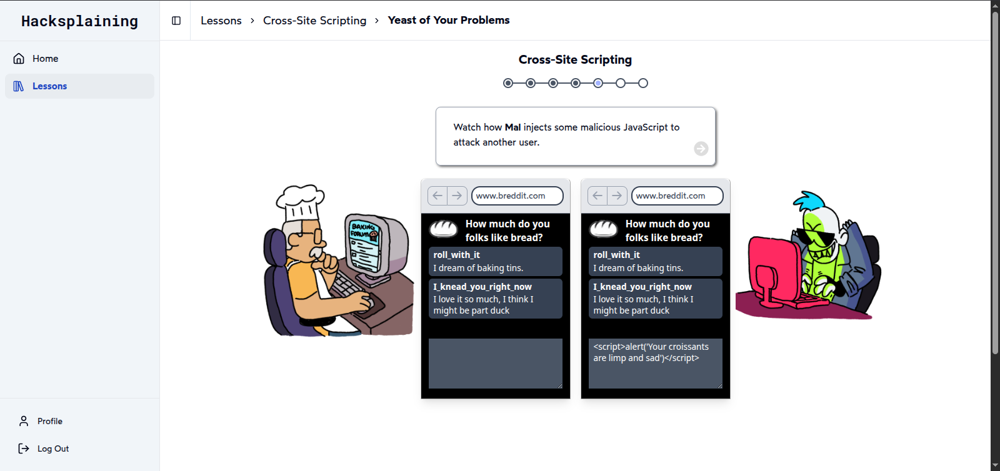
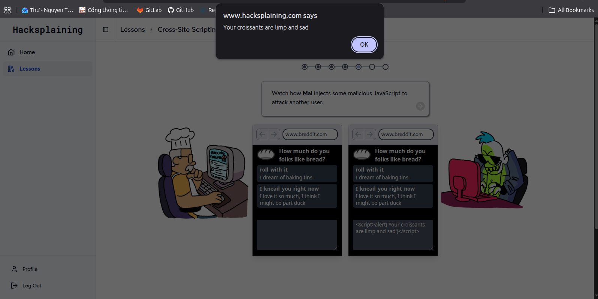
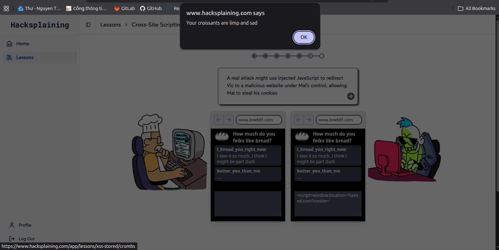
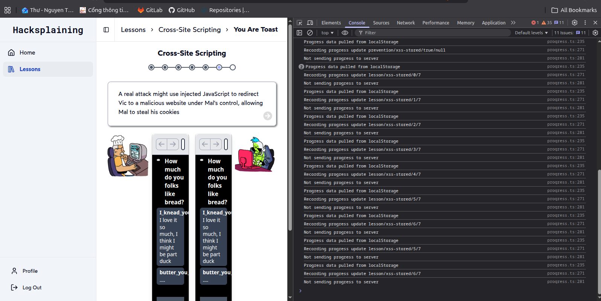
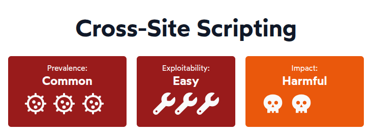
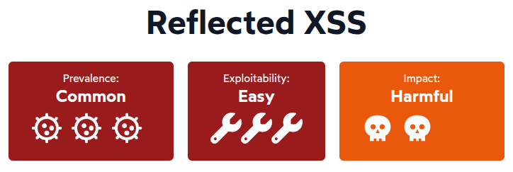
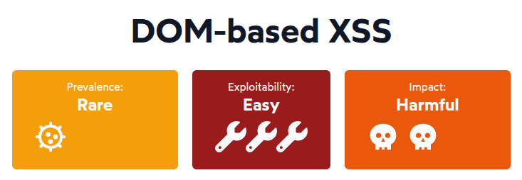

# Cross-site scripting (XSS)
**Cross-site scripting (XSS)** là một lỗ hổng bảo mật phổ biến trong các ứng dụng web, cho phép kẻ tấn công chèn mã JavaScript độc hại vào trang web mà người dùng khác sẽ truy cập.

---

## 1. Stored XSS
### 1.1. Overview

<div align="center">
  
  d
  
  
</div>

Tưởng tượng chúng ta có một trang web cho phép người dùng **đăng bình luận**. Và bình luận đó c**ần được lưu lại** để hiển thị cho những người dùng khác. Nếu chúng ta không kiểm tra và xử lý đúng cách nội dung bình luận, kẻ tấn công có thể **chèn mã JavaScript** độc hại vào bình luận đó. Khi người dùng khác truy cập trang web và xem bình luận, **mã JavaScript độc hại sẽ được thực thi trong trình duyệt của họ**, dẫn đến việc đánh cắp thông tin cá nhân hoặc thực hiện các hành động không mong muốn.

### 1.2. Rủi ro của Stored XSS

<div align="center">
  
</div>

* Thường xuất hiện ở **các trang mạng xã hội** như Facebook, Twitter, Instagram, nơi người dùng có thể đăng bài viết, bình luận hoặc chia sẻ nội dung.
* Có thể đánh cắp **session của người dùng** bằng cách **gửi session ID tới máy của kẻ tấn công**, sau đó cho phép kẻ tấn công truy cập vào tài khoản của người dùng đó.
* **Đánh cắp danh tính** như là thông tin cá nhân, mật khẩu, credit card, v.v. có thể bị đánh cắp thông qua XSS.
* Có thể **tấn công từ chối dịch vụ (DoS)** và **phá hoại trang web**.

---
## 2. Reflected XSS
### 2.1. Overview

Khác với **Stored XSS**, **Reflected XSS** cùng là chèn mã JS độc hại vào trang web, nhưng không lưu trữ mã đó trong data store. Thay vào đó, mã độc được gửi trực tiếp đến server thông qua URL hoặc form input và ngay lập tức được phản hồi lại cho người dùng mà không qua bất kỳ bước xử lý nào.

### 2.2. Rủi ro của Reflected XSS

<div align="center">
  
</div>

**Reflected XSS** thông thường **ít nguy hiểm hơn Stored XSS** vì nó chỉ ảnh hưởng tới người dùng nhấp vào link độc hại. Tuy nhiên nó lại **phổ biến hơn** 

Bất kì web nào **nhận tham số từ phương thức GET hoặc POST** đều có thể bị tấn công vì khi đó trang web sẽ tin tưởng vào **nội dung độc hại** mà hacker tạo ra và tạo ra link độc hại. Kẻ tấn công có thể gửi email hoặc chia sẻ link độc hại để lừa người dùng nhấp vào, dẫn đến việc mã độc được thực thi trong trình duyệt của họ.

Khi review code, ngoài việc kiểm tra tương tác kiểm tra với dữ liệu, hãy lưu ý:

* **Kết quả tìm kiếm**: Có đủ tiêu chuẩn để hiển thị lại cho người dùng, có được mã hóa đúng cách không?
* **Thông báo lỗi**: Có hiển thị lại dữ liệu người dùng không? Có được mã hóa đúng cách không?
* **Form input**: Có hiển thị lại dữ liệu người dùng không? Có được mã hóa đúng cách không? Có xử lý đúng cách nếu dữ liệu đó là một URL không?
---

## 3. DOM-based XSS
### 3.1. Overview

**Vì các JS framework ngày càng phức tạp**, vì thể workload của phía client ngày càng tăng, dẫn đến nhu cầu chống lại các cuộc tấn công ngay trên browser cũng gia tăng.

**DOM-based XSS** có nhiều điểm giống với **Reflected XSS** nhưng khác ở chỗ mã độc của Reflected XSS được phản hổi lại từ server, còn mã độc của DOM-based XSS được tạo ra và thực thi hoàn toàn trên phía client. Kẻ tấn công có thể chèn mã JavaScript độc hại vào URL hoặc form input, và mã đó sẽ được thực thi khi người dùng truy cập trang web mà không cần phải gửi dữ liệu đến server.

## 3.2. Rủi ro của DOM-based XSS
<div align="center">
  
</div>

Ngoài các rủi ro tương tự như **Reflected XSS**, **DOM-based XSS** còn có thể bị lợi dụng để **thay đổi nội dung của trang web** hoặc **thực hiện các hành động không mong muốn** mà không cần phải gửi dữ liệu đến server. Điều này làm cho DOM-based XSS trở nên nguy hiểm hơn vì nó có thể bypass các biện pháp bảo mật phía server.

---
## 4. Cách phòng chống XSS

Để phòng chống XSS, cần đảm bảo các dữ liệu đầu vào từ người dùng được **kiểm tra và xử lý đúng cách** trước khi hiển thị trên trang web. Dưới đây là một số cách để phòng chống XSS:

### 4.1. Mã hóa dữ liệu (Escape Dynamic Content)

Trang web thông thường được tạo bằng HTML, một dạng file tĩnh và render khi có thay đổi để hiển thị nội dung động. **Stored XSS attack** lợi dụng điều này bằng cách chèn mã JavaScript độc hại vào các trường có thể chỉnh sửa. Khi người dùng khác truy cập trang web, mã độc sẽ được thực thi trong trình duyệt của họ.

Trừ khi trang web của bạn là một hệ thống quản lý nội dung (CMS), rất hiếm khi bạn muốn người dùng có thể viết HTML thuần túy. Thay vào đó, bạn nên **mã hóa tất cả nội dung động** từ data store, để trình duyệt biết rằng nó phải được xử lý như nội dung của thẻ HTML, chứ không phải HTML thuần túy có thể thực thi.

**Mã hóa nội dung động** thường bao gồm việc thay thế các ký tự đặc biệt bằng mã hóa HTML entity:

| Ký tự | Mã hóa |
|-------|--------|
| <     | &#60   |
| >     | &#62   |
| &     | &#38   |
| "     | &#34   |
| '     | &#39   |

Hầu hết các framework hiện đại sẽ mã hóa nội dung động theo mặc định. Việc mã hóa nội dung có thể chỉnh sửa theo cách này có nghĩa là nó sẽ không bao giờ được trình duyệt xử lý như mã thực thi. Điều này đóng cửa với hầu hết các cuộc tấn công XSS.

**Ví dụ:**
```javascript
// Không an toàn - Hiển thị trực tiếp
element.innerHTML = userInput;

// An toàn - Sử dụng textContent
element.textContent = userInput;
```

### 4.2. Danh sách trắng giá trị (Allowlist Values)

Nếu một phần dữ liệu động cụ thể chỉ có thể nhận một **số giá trị hợp lệ nhất định**, phương pháp tốt nhất là **giới hạn các giá trị trong data store** và chỉ cho phép logic hiển thị những giá trị đã biết là an toàn.

**Ví dụ:** Thay vì để người dùng nhập tên quốc gia của họ, hãy cho họ chọn từ một danh sách thả xuống (dropdown list). Điều này đảm bảo chỉ những giá trị được định nghĩa trước mới được chấp nhận.

```javascript
// Ví dụ danh sách trắng
const allowedCountries = ['Vietnam', 'USA', 'Japan', 'Korea'];
if (!allowedCountries.includes(userInput)) {
  throw new Error('Invalid country');
}
```

### 4.3. Triển khai Content Security Policy (CSP)

Trình duyệt hỗ trợ **Content Security Policy** cho phép tác giả trang web kiểm soát nơi JavaScript (và các tài nguyên khác) có thể được tải và thực thi. Các cuộc tấn công XSS dựa vào khả năng của kẻ tấn công trong việc chạy các script độc hại trên trang web của người dùng - bằng cách chèn thẻ `<script>` inline vào đâu đó trong thẻ `<html>`, hoặc lừa trình duyệt tải JavaScript từ một domain của bên thứ ba độc hại.

Bằng cách **thiết lập Content Security Policy trong response header**, bạn có thể yêu cầu trình duyệt không bao giờ thực thi JavaScript inline và khóa các domain có thể lưu trữ JavaScript cho trang:

```
Content-Security-Policy: script-src 'self' https://apis.google.com
```

Bằng cách liệt kê các URI mà script có thể được tải từ đó, bạn đang ngầm định nói rằng **JavaScript inline không được phép**.

Content Security Policy cũng có thể được thiết lập trong thẻ `<meta>` trong phần tử `<head>` của trang:

```html
<meta http-equiv="Content-Security-Policy" 
      content="script-src 'self' https://apis.google.com">
```

**CSP Violation Reports:**

Để chuyển đổi khỏi inline scripts một cách từng bước, hãy cân nhắc sử dụng CSP Violation Reports. Bằng cách thêm directive `report-to` trong policy header, trình duyệt sẽ thông báo cho bạn về bất kỳ vi phạm policy nào, thay vì ngăn JavaScript inline thực thi:

```
Reporting-Endpoints: csp-endpoint="https://example.com/csp-reports"
Content-Security-Policy-Report-Only: script-src 'self'; report-to csp-endpoint
```

Điều này sẽ cho bạn sự đảm bảo rằng không có inline scripts nào còn tồn tại, trước khi bạn cấm chúng hoàn toàn.

### 4.4. Làm sạch HTML (Sanitize HTML)

Một số trang web có **nhu cầu hợp pháp để lưu trữ và hiển thị HTML thuần túy**. Nếu trang web của bạn lưu trữ và hiển thị nội dung phong phú (rich content), bạn cần sử dụng một **thư viện làm sạch HTML** để đảm bảo người dùng độc hại không thể chèn scripts vào nội dung HTML của họ.

**Các thư viện phổ biến:**
- **DOMPurify** (JavaScript): Thư viện làm sạch HTML phổ biến nhất
- **Bleach** (Python): Thư viện làm sạch HTML dựa trên whitelist
- **OWASP Java HTML Sanitizer** (Java): Thư viện từ OWASP

**Ví dụ với DOMPurify:**
```javascript
import DOMPurify from 'dompurify';

// Làm sạch HTML từ người dùng
const clean = DOMPurify.sanitize(userHTML);
element.innerHTML = clean;
```
### 4.5. Kiểm tra code cẩn thận
* Kiểm tra tất cả các điểm tương tác với dữ liệu, đặc biệt là những nơi dữ liệu được hiển thị lại cho người dùng. (ví dụ những chỗ dùng `window.location.hash`, `document.write()`, `innerHTML`, v.v.)
* Tránh render HTML từ dữ liệu không đáng tin cậy. (ví dụ thay `innerHTML` bằng `textContent` hoặc `createTextNode()`)
* Cẩn thận khi chuyển từ dữ liệu `JSON` sang `JS object` (ví dụ dùng `JSON.parse()` thay vì `eval()`) để tránh việc thực thi mã độc nếu dữ liệu JSON bị giả mạo.
* Sử dụng một số công cụ tự động quét như **Burp Suite** để kiểm tra các lỗ hổng XSS trong ứng dụng của bạn.
* **Không sử dụng URI ở tất cả mọi nơi**. Nếu bạn cần sử dụng URI, hãy đảm bảo rằng chúng được kiểm tra kỹ lưỡng để loại bỏ các URI nguy hiểm như `javascript:`, `data:`, v.v.
---

## 5. Code samples 

Tôi chọn ví dụ với **React** vì nó là một trong những framework phổ biến nhất hiện nay và có nhiều cách để phòng chống XSS.

### 5.1. React - Tự động Escape Dynamic Content (An toàn)

React tự động **escape** (mã hóa) bất kỳ nội dung động nào được viết trong dấu ngoặc nhọn `{}`. Điều này có nghĩa là bất kỳ mã JavaScript nào cũng sẽ được hiển thị như văn bản thuần túy, không phải mã thực thi.

**Ví dụ an toàn:**
```jsx
function UserComment({ comment }) {
  // Nội dung động sẽ tự động được escape
  return <div>{comment}</div>
}

// Nếu comment = "<script>alert('XSS')</script>"
// Kết quả hiển thị: <div>&lt;script&gt;alert('XSS')&lt;/script&gt;</div>
// Trình duyệt sẽ hiển thị văn bản chứ không thực thi script
```

**Ví dụ với các thuộc tính:**
```jsx
function UserProfile({ username, bio }) {
  return (
    <div>
      <h1>{username}</h1>
      <p>{bio}</p>
      {/* Cả username và bio đều tự động được escape */}
    </div>
  );
}
```

### 5.2. React - dangerouslySetInnerHTML (Không an toàn)

React cung cấp thuộc tính `dangerouslySetInnerHTML` để cho phép render HTML thuần túy. **Tên của nó đã cảnh báo về rủi ro bảo mật!** Nếu bạn sử dụng thuộc tính này với nội dung từ người dùng mà không làm sạch, ứng dụng của bạn sẽ dễ bị tấn công XSS.

**Ví dụ KHÔNG AN TOÀN:**
```jsx
function UnsafeComponent({ userContent }) {
  // NGUY HIỂM! Nội dung này không được escape
  return (
    <div dangerouslySetInnerHTML={{ __html: userContent }} />
  );
}

// Nếu userContent = ""
// Script sẽ được thực thi!
```

**Cách sử dụng AN TOÀN với DOMPurify:**
```jsx
import DOMPurify from 'dompurify';

function SafeHTMLComponent({ userHTML }) {
  // Làm sạch HTML trước khi render
  const cleanHTML = DOMPurify.sanitize(userHTML);
  
  return (
    <div dangerouslySetInnerHTML={{ __html: cleanHTML }} />
  );
}

// DOMPurify sẽ loại bỏ tất cả các thẻ và thuộc tính nguy hiểm
```

### 5.3. React - Sử dụng href với Dynamic Links

Khi sử dụng URL động trong thuộc tính `href`, cần cẩn thận với **JavaScript URIs** vì chúng có thể thực thi mã độc.

**Ví dụ KHÔNG AN TOÀN:**
```jsx
function UnsafeLink({ url }) {
  // NGUY HIỂM! url có thể là "javascript:alert('XSS')"
  return <a href={url}>Click here</a>;
}
```

**Cách sử dụng AN TOÀN:**
```jsx
function SafeLink({ url }) {
  // Kiểm tra URL chỉ cho phép http/https
  const isSafeURL = (url) => {
    try {
      const parsed = new URL(url);
      return ['http:', 'https:'].includes(parsed.protocol);
    } catch {
      return false;
    }
  };
  
  const safeUrl = isSafeURL(url) ? url : '#';
  
  return <a href={safeUrl}>Click here</a>;
}
```

**Hoặc sử dụng whitelist:**
```jsx
function SafeLinkWithWhitelist({ url }) {
  const allowedDomains = ['example.com', 'trusted-site.com'];
  
  const isSafeURL = (url) => {
    try {
      const parsed = new URL(url);
      return ['http:', 'https:'].includes(parsed.protocol) &&
             allowedDomains.some(domain => parsed.hostname.endsWith(domain));
    } catch {
      return false;
    }
  };
  
  if (!isSafeURL(url)) {
    return <span>Invalid URL</span>;
  }
  
  return <a href={url} rel="noopener noreferrer">Click here</a>;
}
```

### 5.4. React - Xử lý User Input trong Forms

Khi xử lý input từ người dùng, luôn validate và sanitize dữ liệu trước khi lưu hoặc hiển thị.

**Ví dụ với form an toàn:**
```jsx
import { useState } from 'react';
import DOMPurify from 'dompurify';

function CommentForm() {
  const [comment, setComment] = useState('');
  const [savedComment, setSavedComment] = useState('');

  const handleSubmit = (e) => {
    e.preventDefault();
    
    // Validate và sanitize input
    const sanitized = DOMPurify.sanitize(comment, {
      ALLOWED_TAGS: [], // Không cho phép bất kỳ HTML tag nào
      ALLOWED_ATTR: []  // Không cho phép bất kỳ thuộc tính nào
    });
    
    // Lưu comment đã được làm sạch
    setSavedComment(sanitized);
    
    // Gửi đến server (nên validate lại ở phía server)
    // await api.saveComment(sanitized);
  };

  return (
    <div>
      <form onSubmit={handleSubmit}>
        <textarea
          value={comment}
          onChange={(e) => setComment(e.target.value)}
          placeholder="Nhập bình luận của bạn..."
          maxLength={500}
        />
        <button type="submit">Gửi</button>
      </form>
      
      {savedComment && (
        <div>
          <h3>Bình luận của bạn:</h3>
          {/* An toàn vì React tự động escape */}
          <p>{savedComment}</p>
        </div>
      )}
    </div>
  );
}
```

### 5.5. React - Content Security Policy (CSP) Implementation

Thêm CSP vào ứng dụng React để tăng cường bảo mật:

**Trong HTML template (public/index.html):**
```html
<!DOCTYPE html>
<html lang="en">
  <head>
    <meta charset="utf-8" />
    <meta name="viewport" content="width=device-width, initial-scale=1" />
    
    <!-- Content Security Policy -->
    <meta 
      http-equiv="Content-Security-Policy" 
      content="
        default-src 'self';
        script-src 'self' 'unsafe-inline' 'unsafe-eval';
        style-src 'self' 'unsafe-inline';
        img-src 'self' data: https:;
        font-src 'self';
        connect-src 'self' https://api.example.com;
      "
    />
    
    <title>React App</title>
  </head>
  <body>
    <div id="root"></div>
  </body>
</html>
```

**Hoặc cấu hình trong server (Express.js example):**
```javascript
const express = require('express');
const helmet = require('helmet');

const app = express();

// Sử dụng helmet để set CSP headers
app.use(
  helmet.contentSecurityPolicy({
    directives: {
      defaultSrc: ["'self'"],
      scriptSrc: ["'self'", "'unsafe-inline'"],
      styleSrc: ["'self'", "'unsafe-inline'"],
      imgSrc: ["'self'", "data:", "https:"],
      connectSrc: ["'self'", "https://api.example.com"],
      fontSrc: ["'self'"],
      objectSrc: ["'none'"],
      mediaSrc: ["'self'"],
      frameSrc: ["'none'"],
    },
  })
);

app.use(express.static('build'));

app.listen(3000);
```
### 5.6. Testing XSS Vulnerabilities

**Các payload test phổ biến:**
```javascript
// Test cases để kiểm tra XSS vulnerabilities
const xssTestPayloads = [
  '<script>alert("XSS")</script>',
  '',
  '<svg onload="alert(\'XSS\')">',
  'javascript:alert("XSS")',
  '<iframe src="javascript:alert(\'XSS\')"></iframe>',
  '"><script>alert("XSS")</script>',
  '<body onload="alert(\'XSS\')">',
  '<input onfocus="alert(\'XSS\')" autofocus>',
  '<select onfocus="alert(\'XSS\')" autofocus>',
  '<textarea onfocus="alert(\'XSS\')" autofocus>',
];

// Function để test component
function testComponentForXSS(Component, props) {
  xssTestPayloads.forEach(payload => {
    const testProps = { ...props, userInput: payload };
    // Render component và kiểm tra xem alert có được trigger không
    // Nếu alert được trigger, component có lỗ hổng XSS
  });
}
```

**Ví dụ unit test với Jest:**
```javascript
import { render } from '@testing-library/react';
import DOMPurify from 'dompurify';
import SafeComponent from './SafeComponent';

describe('XSS Protection Tests', () => {
  it('should escape malicious script tags', () => {
    const maliciousInput = '<script>alert("XSS")</script>';
    const { container } = render(
      <SafeComponent content={maliciousInput} />
    );
    
    // Script tag không nên được thực thi
    expect(container.querySelector('script')).toBeNull();
    expect(container.textContent).toContain('alert("XSS")');
  });
  
  it('should sanitize HTML with DOMPurify', () => {
    const maliciousHTML = '';
    const clean = DOMPurify.sanitize(maliciousHTML);
    
    // onerror handler nên bị loại bỏ
    expect(clean).not.toContain('onerror');
    expect(clean).not.toContain('alert');
  });
  
  it('should reject javascript: URLs', () => {
    const maliciousURL = 'javascript:alert("XSS")';
    const { container } = render(
      <SafeComponent url={maliciousURL} />
    );
    
    const link = container.querySelector('a');
    expect(link?.getAttribute('href')).not.toBe(maliciousURL);
  });
});
```
---
## 6. Tài liệu tham khảo
* [Hackplaning](https://www.hacksplaining.com/app/lessons/xss-stored/start)
* [OWASP XSS Prevention Cheat Sheet](https://cheatsheetseries.owasp.org/cheatsheets/Cross_Site_Scripting_Prevention_Cheat_Sheet.html)
* [DOMPurify Documentation](https://github.com/cure53/DOMPurify)
* [Content Security Policy (CSP) Guide](https://developers.google.com/web/tools/csp)
* [React Security Best Practices](https://reactjs.org/docs/security.html)
* [Testing for XSS Vulnerabilities](https://www.owasp.org/index.php/Testing_for_Cross_Site_Scripting_(OTG-XSS))

